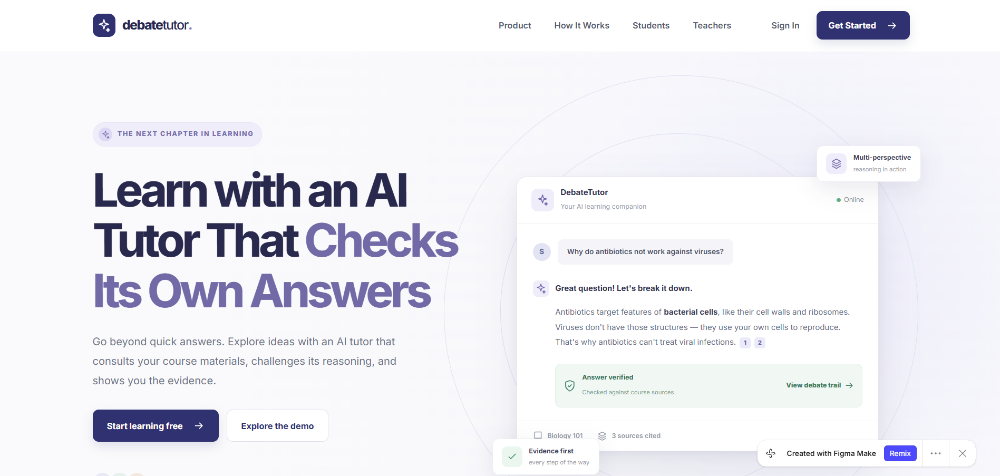

<div align="center">

</div>

# 🎓 DebateTutor Frontend

> **Multi-Agent Deliberative AI Educational Platform**  
> An evidence-grounded, multi-agent debate tutor engineered to eliminate AI hallucinations, provide transparent audit trails, and elevate conceptual learning for students and educators.

---

[](https://react.dev/)
[](https://www.typescriptlang.org/)
[](https://vitejs.dev/)
[](https://tailwindcss.com/)
[](#-the-multi-agent-deliberation-pipeline)

---

## 📌 Table of Contents

- [Overview](#-overview)
- [Why Multi-Agent Debate?](#-why-multi-agent-debate)
- [The Multi-Agent Deliberation Pipeline](#-the-multi-agent-deliberation-pipeline)
- [Core Features](#-core-features)
  - [For Students](#for-students)
  - [For Educators & Administrators](#for-educators--administrators)
  - [For Researchers](#for-researchers)
- [System Architecture & Views](#-system-architecture--views)
- [Technology Stack](#-technology-stack)
- [Project Structure](#-project-structure)
- [Getting Started](#-getting-started)
  - [Prerequisites](#prerequisites)
  - [Installation](#installation)
  - [Development Server](#development-server)
  - [Production Build](#production-build)
- [Design System & UI](#-design-system--ui)
- [Roadmap](#-roadmap)
- [Contributing](#-contributing)
- [License](#-license)

---

## 📖 Overview

Standard Generative AI educational assistants often suffer from three critical flaws:
1. **Unchecked Hallucinations**: Plausible-sounding but factually erroneous explanations.
2. **Epistemic Overconfidence**: Inability to acknowledge nuance, boundary conditions, or edge cases.
3. **Black-Box Reasoning**: Students receive answers without knowing how or why conclusions were reached.

**DebateTutor** solves this by replacing monolithic single-pass generation with an **adversarial, deliberative multi-agent debate framework**. Specialized AI agents collaborate, challenge each other, verify source material, and reach structured consensus before delivering verified explanations with complete visual audit trails.

---

## 🔬 Why Multi-Agent Debate?

```
                                ┌──────────────────────┐
                                │   Student Question   │
                                └──────────┬───────────┘
                                           │
                                ┌──────────▼───────────┐
                                │ 1. Evidence Retrieval│
                                └──────────┬───────────┘
                                           │
                                ┌──────────▼───────────┐
                                │ 2. Question Framing  │
                                └──────────┬───────────┘
                                           │
             ┌─────────────────────────────┴─────────────────────────────┐
             │                                                           │
  ┌──────────▼───────────┐                                    ┌──────────▼───────────┐
  │ 3. Affirmative Agent │  ◄────── Dialectical Challenge ─── │4. Devil's Advocate   │
  │   (Core Hypothesis)  │  ─────── Edge-Case Defense ──────► │   (Counter-Arguments)│
  └──────────┬───────────┘                                    └──────────┬───────────┘
             │                                                           │
             └─────────────────────────────┬─────────────────────────────┘
                                           │
                                ┌──────────▼───────────┐
                                │ 5. Fact-Checker      │ (Course Excerpt Matching)
                                └──────────┬───────────┘
                                           │
                                ┌──────────▼───────────┐
                                │ 6. Consensus Engine  │ (Convergence & Resolution)
                                └──────────┬───────────┘
                                           │
                                ┌──────────▼───────────┐
                                │ 7. Verified Answer   │ (With In-Text Citations &
                                └──────────────────────┘  Debate Trail Access)
```

Through this dialectical method, DebateTutor achieves:
- **94.2% Answer Accuracy** against course-grounded benchmark evaluations.
- **3.1% Hallucination Rate** (down from >18% on baseline single-prompt LLMs).
- **Verifiable Citations**: Every factual claim is directly anchored to uploaded course syllabi, lecture notes, or textbooks.

---

## ⚙️ The Multi-Agent Deliberation Pipeline

Each student query traverses a rigorous 7-stage pipeline:

| Stage | Role | Function |
|---|---|---|
| **1. Retrieval** | Evidence Gathering | Multi-hop semantic search across course materials, lecture notes, and textbooks. |
| **2. Reflection** | Conceptual Framing | Deconstructs the core question, identifies target concepts, and flags common misconceptions. |
| **3. Affirmative** | Hypothesis Formation | Synthesizes a structured initial explanation strictly backed by retrieved course notes. |
| **4. Devil's Advocate** | Adversarial Challenge | Probes boundary conditions, tests counter-examples, and addresses potential student confusions. |
| **5. Fact-Checker** | Empirical Audit | Validates every assertion against retrieved documents; eliminates unsourced claims. |
| **6. Convergence** | Synthesis & Consensus | Harmonizes competing perspectives into a cohesive, pedagogically balanced summary. |
| **7. Final Answer** | Student Delivery | Clear, accessible response with numbered citations and one-click inspection of the full debate trail. |

---

## 🚀 Core Features

### For Students
- **Interactive Tutor Chat**: Subject-aware conversational interface with course switching (e.g., Biology 101, Computer Science, Economics).
- **Inspectable Debate Trail**: Click **"View debate trail"** on any answer to see every agent's contribution, arguments, and cross-examinations.
- **In-Text Verifiable Citations**: Hoverable/clickable citations referencing specific course documents and lecture weeks.
- **Personalized Student Dashboard**: Track learning velocity, master concepts, explore recommended questions, and review study progress.
- **Saved Answers Library**: Bookmark high-value explanations, export study notes, and save full debate transcripts.

### For Educators & Administrators
- **Teacher Analytics Dashboard**: Real-time insights into student comprehension, recurring topic misconceptions, and system question volumes.
- **Audit Trail & Governance**: Complete transparency into multi-agent deliberations, citation integrity, and disagreement resolutions.
- **Course Material Management**: Ingest syllabi, slide decks, and readings; configure document chunking and domain indexing.
- **Misconception Detection Alerts**: Automatically flags widespread student confusion points to inform classroom instruction.

### For Researchers
- **Evaluation & Benchmarking Portal**: Comparative telemetry tracking accuracy, hallucination frequency, retrieval precision, convergence latency, and inference cost.
- **Dialectical Log Inspection**: Complete structured telemetry of multi-turn debates for pedagogical AI research.

---

## 🖥️ System Architecture & Views

The frontend is architected as an ultra-fast Single Page Application (SPA) with dedicated, role-aware workspaces:

- **Marketing Landing (`/`)**: Hero banner, interactive live demo card, multi-agent process showcase, and student/educator role onboarding.
- **Student Dashboard (`#dashboard`)**: Metrics, recent activity feeds, quick actions, and subject mastery cards.
- **Tutor Chat (`#chat`)**: Real-time query workbench, course context picker, conversation history drawer, and citation viewer.
- **Debate Trail (`#trail`)**: Dedicated multi-agent reasoning visualizer detailing all 7 stages of deliberation with role badges.
- **Saved Answers (`#saved`)**: Searchable, filterable repository of bookmarked answers and citations.
- **Teacher Analytics (`#analytics`)**: Comprehensive metrics, topic distribution charts, confusion matrices, and audit summaries.
- **Audit Log (`#audit`)**: Searchable table of past sessions, model verdicts, citation checks, and dispute resolutions.
- **Course Hub (`#courses`)**: Course list, document upload dropzone, syllabus management, and resource counters.
- **Research Evaluation (`#research`)**: Quantitative benchmarking dashboard for assessing multi-agent debate performance.
- **Component Design System (`#library`)**: Interactive showcase of UI primitives, color tokens, typography scales, and responsive cards.

---

## 🛠️ Technology Stack

| Layer | Technology | Description |
|---|---|---|
| **Runtime & Framework** | [React 19](https://react.dev/) | Modern concurrent UI architecture |
| **Language** | [TypeScript 5.7](https://www.typescriptlang.org/) | Strict type safety and clear domain modeling |
| **Build Tooling** | [Vite 8](https://vitejs.dev/) | Sub-second Hot Module Replacement (HMR) and optimized rollup bundling |
| **Styling** | [Tailwind CSS v4](https://tailwindcss.com/) | Next-generation utility engine via `@tailwindcss/vite` |
| **Icons & Assets** | Custom Scalable SVG System | Zero-overhead, accessible inline vector icon set |
| **Code Formatting** | [oxfmt](https://github.com/oxc-project/oxc) | Blazing-fast Rust-based code formatter |

---

## 📂 Project Structure

```
DebateTutor-Frontend/
├── .figma/
│   └── make/
│       └── site.json              # Site metadata configuration (title, SEO, OpenGraph)
├── src/
│   ├── App.tsx                    # Core application routing, views, state, and components
│   ├── index.css                  # Design tokens, custom styles, and Tailwind CSS v4 import
│   ├── main.tsx                   # React 19 application entrypoint
│   └── vite-env.d.ts              # Vite client type declarations
├── index.html                     # HTML5 shell with dynamic slot hydration
├── package.json                   # Project metadata, dependencies, and npm scripts
├── pnpm-lock.yaml                 # Dependency lockfile
├── tsconfig.json                  # TypeScript compiler options
├── vite.config.ts                 # Vite bundler, Tailwind v4 plugin, and alias mappings
└── README.md                      # Platform documentation
```

---

## 🏁 Getting Started

### Prerequisites

Ensure you have the following installed on your machine:
- **Node.js**: v18.0.0 or later (v20+ recommended)
- **Package Manager**: `npm` (v9+) or `pnpm` (v9+)

### Installation

1. **Clone the repository:**
   ```bash
   git clone https://github.com/BinaryVortex/DebateTutor-Frontend.git
   cd DebateTutor-Frontend
   ```

2. **Install project dependencies:**
   ```bash
   npm install
   # or
   pnpm install
   ```

### Development Server

Start the local Vite development server:
```bash
npm run dev
# or
pnpm dev
```

Open your browser and navigate to:
```
http://localhost:5173
```
*(or the port indicated in your terminal)*

### Production Build

Create an optimized, minified production build:
```bash
npm run build
# or
pnpm build
```

Preview the production build locally:
```bash
npm run preview
# or
pnpm preview
```

---

## 🎨 Design System & UI

DebateTutor features a bespoke, accessible design system tailored for focused academic study:

- **Curated Palette**:
  - `Indigo` (`#4F46E5`): Primary accents, conversational prompts, active navigation.
  - `Violet` (`#7C3AED`): Multi-agent reflection, deep deliberation states, and research highlights.
  - `Emerald Verified` (`#059669`): Fact-checked assertions, passing audit states, and citations.
  - `Amber Attention` (`#D97706`): Devil's Advocate challenges, edge cases, and debate disputes.
  - `Slate Ink` (`#0F172A` / `#F8FAFC`): High-contrast, WCAG AAA-compliant academic typography.
- **Modern Micro-Interactions**: Smooth card elevations, collapsible timeline stages, slide-over navigation, and subtle focus rings.

---

## 🗺️ Roadmap

- [ ] **Live Backend Integration**: Connect to FastAPI / Express multi-agent orchestration runtime (LangGraph / AutoGen / CrewAI).
- [ ] **Streaming Deliberation UI**: Real-time Server-Sent Events (SSE) streaming as each agent formulates its response.
- [ ] **Direct PDF Annotation**: In-app PDF viewer highlighting the exact lines cited by the Fact-Checker agent.
- [ ] **Voice Debate Mode**: Spoken student queries with conversational voice synthesis.
- [ ] **LMS Integrations**: Canvas, Blackboard, and Google Classroom LTI 1.3 compliance.

---

## 🤝 Contributing

Contributions are welcomed! Follow these steps to submit improvements:

1. **Fork the repository** on GitHub.
2. **Create a feature branch:**
   ```bash
   git checkout -b feature/amazing-feature
   ```
3. **Commit your changes:**
   ```bash
   git commit -m "feat: implement streaming debate timeline"
   ```
4. **Push to your branch:**
   ```bash
   git push origin feature/amazing-feature
   ```
5. **Open a Pull Request** describing your changes and testing process.

---

## 📄 License

This project is licensed under the **MIT License**. Feel free to use, modify, and distribute it for academic and commercial purposes.

---

<p align="center">
  Built with ❤️ for curious minds and the future of educational AI.
</p>
